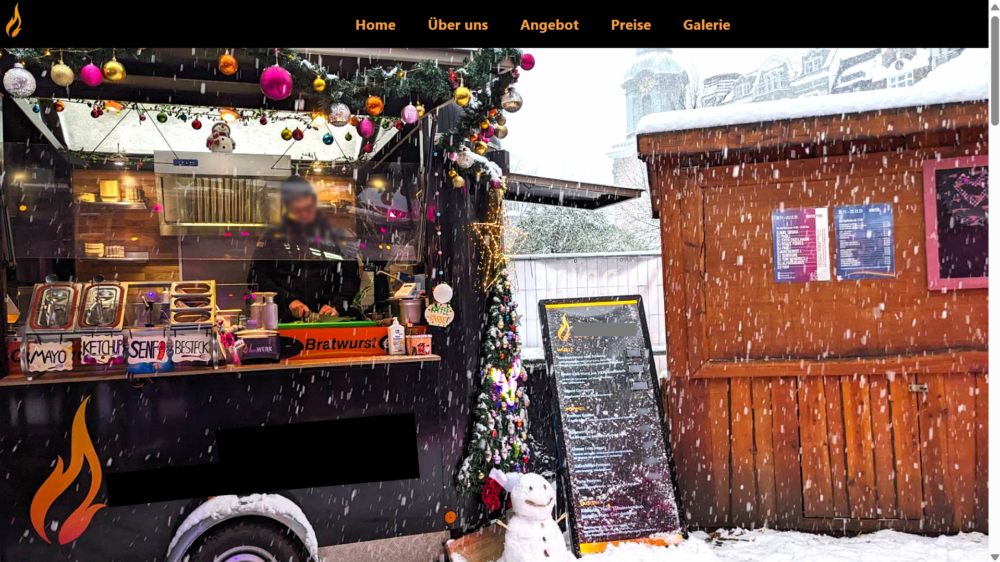
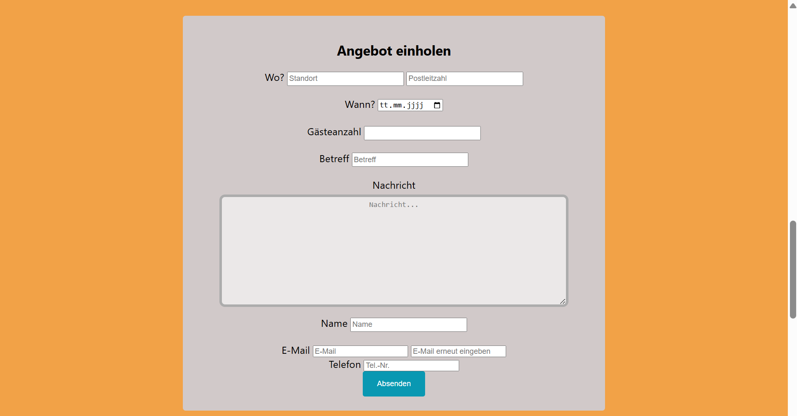
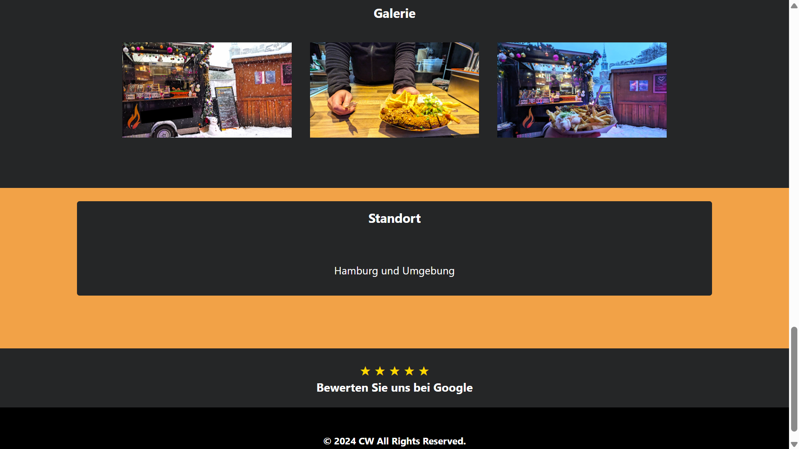

## CW

CW is a single-page landing business website with a focus on product presentation, user interaction, and client-side validation.

---

## Contact Form with Client-Side Validation

This project features a simple, interactive web page including:

- A modal contact form with client-side validation using **[Validate.js](https://validatejs.org/)**.
- Smooth scrolling navigation.
- Image and video transitions adapting to screen size.
- Basic user input restrictions (e.g., no copy-paste allowed on the email confirmation field).
- Responsive design for various devices.
- IP-based geolocation check to restrict access outside Germany.

---

## Features

- **Form Validation:**  
  Utilizes Validate.js to enforce required fields and constraints before submission.  
  Custom validations include matching email confirmation, date checks, and format validations.

- **Modal Window:**  
  The main image triggers a modal with the contact form, which can be closed via button or Escape key.

- **Navigation:**  
  Smooth scrolling behaviour on navigation link clicks for a seamless user experience.

- **Media Handling:**  
  Responsive switching between images and video depending on device viewport width.

- **Vanilla JavaScript:**  
  All interactive functionality is implemented with plain JavaScript for lightweight and framework-free performance.

- **Device Compatibility:**  
  Responsive design and media switching ensure optimal user experience across desktops, tablets, and mobile devices.

- **Security Measures:**  
  Disables copy, cut, and paste on the email confirmation input to avoid user errors.

- **Geolocation:**  
  Restricts site access to users located in Germany based on IP geolocation.

---

## Technologies Used

- **HTML / CSS / Vanilla JavaScript** (no frameworks or libraries except Validate.js)
- **PHP** (for form submission and client notifications)
- **Validate.js** (client-side form validation)
- **FontAwesome** (icon library)
- External APIs: [ipapi.co](https://ipapi.co/) for IP geolocation

---

## Usage

1. Clone the repository or download the source files.
2. Open `index.html` in your browser.
3. Click the main image to open the contact form modal.
4. Complete the form and submit; validation errors will appear if inputs are invalid.

---

## Notes

- Client-side validation is implemented; **server-side validation is strongly recommended** before deploying to production.
- Geolocation blocking relies on an external API and may not be 100% accurate.
- An active internet connection is needed to load external scripts and APIs.

**This project is based on a real-world business website. To protect privacy and prevent spam, sensitive data such as real contact information, company names, or branding elements have been anonymized or omitted.**

---
